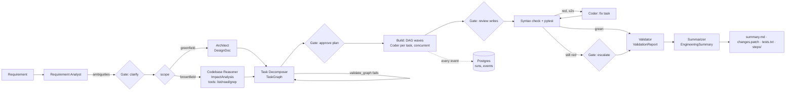

# Architecture

## Pieces

| Piece | Where | Role |
|---|---|---|
| Typed contracts | `models.py` | Every hand-off between agents is a Pydantic model. The model's output is validated against it; on failure Pydantic AI re-prompts the model with the validation error. |
| Agents | `agents.py` | Seven `pydantic_ai.Agent`s, one per SDLC role. The Codebase Reasoner and Coder get read-only repo tools (`list_files`, `read_file`, `grep`) that refuse paths outside the repo. |
| Orchestrator | `orchestrator.py` | Runs the pipeline, schedules the task DAG in waves, applies file writes, runs tests, loops on failures, renders the summary. |
| Gate | `orchestrator.py: Gate` | The only place autonomy is decided. Every side effect (clarify, plan, write, escalate) goes through it, so the three modes are one small class rather than `if` statements scattered through the pipeline. |
| Steps (record/replay) | `orchestrator.py: Steps` | Every agent output is saved to `steps/<name>.json`. With `--replay`, outputs are read back instead of calling the model; everything downstream still runs for real. |
| Audit trail | `db.py` | Postgres `runs` and append-only `events` (requirement, plan, each task start/done/error, every gate decision, test runs, fix attempts, validation). |
| Front ends | `cli.py`, `api.py` | Typer CLI (interactive, all modes) and FastAPI (full-auto, for automation). Both call the same `execute()`. |

## How each requirement is met

1. **Requirement understanding.** The Analyst returns a `NormalizedRequirement`: intent, acceptance criteria, ambiguities, one clarifying question per ambiguity, and the default it would assume. The gate asks the questions (or, in full-auto, records the assumptions).
2. **Task decomposition.** The Decomposer returns a `TaskGraph`: tasks with kind, dependencies and the exact files each may touch. `validate_graph` rejects unknown dependencies, cycles, and parallel tasks that share files; errors go back to the model as a retry, so bad plans are corrected rather than executed.
3. **Codebase reasoning.** For brownfield, the Reasoner reads the code through tools before any planning and returns an `ImpactAnalysis` (files, APIs, data-flow changes, risks), which the Decomposer and every Coder task receive. In the pagination example this is what catches that the existing tag filter runs in Python, which would make naive paging wrong.
4. **Orchestration.** Tasks run in topological waves; tasks in a wave run concurrently. Each Coder gets the design/impact context plus the files its dependencies produced. Failures are handled at three levels: schema retries inside an agent, one retry per failed task (then dependents are marked `blocked` rather than run on a broken base), and a test-driven fix loop over the whole change.
5. **Output generation.** Code and tests are written to the target repo; the summary includes the API contract and SQL data model (greenfield) or impact analysis (brownfield); `changes.patch` is the reviewable diff.
6. **Validation and risk control.** A syntax check and the full pytest suite run on the result; the Validator reviews the requirement, plan, diff and test output and returns risks, trade-offs, failure scenarios and guardrails with an approve/revise recommendation. Guardrails in code: per-task file scopes, path-escape and protected-path blocking, bounded retries.
7. **Controlled autonomy.** `suggest` / `auto-edit` / `full-auto`, enforced by the gate (see README).
8. **Final output.** `summary.md` per run: plan and rationale, understanding, architecture or impact, task results, artifacts, risks, trade-offs, failure scenarios, assumptions, limitations.

## Decisions and trade-offs

- **Structured outputs everywhere, not prose.** Costs some prompt flexibility; buys machine-checkable hand-offs, graph validation, and replayable runs.
- **Coder outputs whole files, not patches.** Simpler and robust to model formatting errors; costs tokens on large files. A patch/edit tool is the upgrade for big codebases.
- **File scopes declared up front.** The plan is the contract: a task can only touch what it declared, which makes parallel execution safe and gives the human a meaningful thing to approve. The cost is that a task discovering it needs another file must ask (or fail in full-auto).
- **Test-driven recovery instead of self-critique loops.** Tests are an objective signal; retries are capped at 2 to bound cost, then a human decides.
- **Record/replay at the agent boundary.** Makes demos deterministic and gives a golden-test harness for the orchestrator, but a replay only follows the recorded path (a different answer at a gate that changes the plan will diverge and stop with a clear error).
- **Postgres with `create_all`, no migrations.** Fine for a prototype; alembic comes in with the first schema change.

## Limitations

- The coder sees whole files, so very large files are truncated at 20k characters in prompts.
- Tests run in the orchestrator's own Python environment; target repos with different dependencies would need a per-repo environment (e.g. a pixi env per target).
- No sandbox: generated tests execute locally. Container isolation is the obvious next step before pointing this at untrusted requirements.
- The API only supports full-auto; interactive approvals over HTTP would need a pending-approvals endpoint.
- Recorded examples were hand-authored (no API key was available); live runs have not been validated end to end yet.
