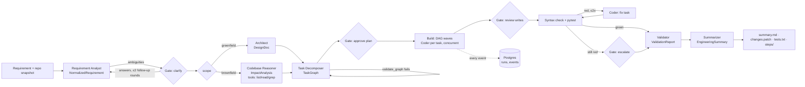

# Architecture

## Pieces

| Piece | Where | Role |
|---|---|---|
| Typed contracts | `models.py` | Every hand-off between agents is a Pydantic model. The model's output is validated against it; on failure Pydantic AI re-prompts the model with the validation error. |
| Agents | `agents.py` | Seven `pydantic_ai.Agent`s, one per SDLC role. The Codebase Reasoner and Coder get read-only repo tools (`list_files`, `read_file`, `grep`) that refuse paths outside the repo, and `run_python`, which executes snippets in the Monty sandbox. |
| Orchestrator | `orchestrator.py` | Runs the pipeline, schedules the task DAG in waves, applies file writes, runs tests, loops on failures, renders the summary. |
| Gate | `orchestrator.py: Gate` | The only place autonomy is decided. Every side effect (clarify, plan, write, escalate) goes through it, so the three modes are one small class rather than `if` statements scattered through the pipeline. |
| Steps (record/replay) | `orchestrator.py: Steps` | Every agent output is saved to `steps/<name>.json`. With `--replay`, outputs are read back instead of calling the model; everything downstream still runs for real. |
| Audit trail | `db.py` | Postgres `runs` and append-only `events` (requirement, plan, each task start/done/error, every gate decision, test runs, fix attempts, validation). |
| Model selection | `agents.py: load_model` | Agents are model-agnostic; the model is chosen per run from a Pydantic AI `<provider>:<model>` string, and the provider resolves its own API key. |
| Mock model | `mock.py` | A `FunctionModel` that answers each agent from the recorded examples through the real agent loop, for offline testing. |
| Toolchains | `toolchains.py` | Detects the repo's language, resolves a toolchain (repo `pixi.toml` → native binaries → an isolated pixi env, with the user's consent), fetches dependencies, and runs the language's test command in the sandbox. |
| Working directories | `cli.py: workspace` | `--from` copies a codebase to a timestamped `work/<name>-<time>/`; `--repo` edits in place; neither creates `work/project-<time>/`. Nothing is ever deleted. |
| Front ends | `session.py`, `cli.py`, `api.py` | Interactive session (model menu, conversational intake, slash commands), scripted CLI, and FastAPI (full-auto, for automation). All call the same `execute()`. |

## How each requirement is met

1. **Requirement understanding.** The Analyst gets the requirement and a snapshot of the working directory's files, and returns a `NormalizedRequirement` (structured output): intent, `scope` (`greenfield` or `brownfield`, decided from the snapshot unless `--scope` is given), acceptance criteria, ambiguities, one clarifying question per ambiguity, and the default it would assume. A request is ambiguous when `ambiguities` is non-empty; this is separate from scope because a brownfield change can be ambiguous too. The gate asks the questions (or, in full-auto, records the assumptions), and the answers go back to the Analyst for up to two follow-up rounds in case they raise new questions.
2. **Task decomposition.** The Decomposer returns a `TaskGraph`: tasks with kind, dependencies and the exact files each may touch. `validate_graph` rejects unknown dependencies, cycles, and parallel tasks that share files; errors go back to the model as a retry, so bad plans are corrected rather than executed.
3. **Codebase reasoning.** For brownfield, the Reasoner reads the code through tools before any planning and returns an `ImpactAnalysis` (files, APIs, data-flow changes, risks), which the Decomposer and every Coder task receive. In the pagination example this is what catches that the existing tag filter runs in Python, which would make naive paging wrong.
4. **Orchestration.** Tasks run in topological waves; tasks in a wave run concurrently. Each Coder gets the design/impact context plus the files its dependencies produced. Failures are handled at three levels: schema retries inside an agent, one retry per failed task (then dependents are marked `blocked` rather than run on a broken base), and a test-driven fix loop over the whole change.
5. **Output generation.** Code and tests are written to the target repo; the summary includes the API contract and SQL data model (greenfield) or impact analysis (brownfield); `changes.patch` is the reviewable diff.
6. **Validation and risk control.** A syntax check and the full pytest suite run on the result, sandboxed and in the repo's own environment when it has one (see below); the Validator reviews the requirement, plan, diff and test output and returns risks, trade-offs, failure scenarios and guardrails with an approve/revise recommendation. Guardrails in code: per-task file scopes, path-escape and protected-path blocking, bounded retries.
7. **Controlled autonomy.** `suggest` / `auto-edit` / `full-auto`, enforced by the gate (see README).
8. **Final output.** `summary.md` per run: plan and rationale, understanding, architecture or impact, task results, artifacts, risks, trade-offs, failure scenarios, assumptions, limitations.

## Decisions and trade-offs

- **Structured outputs everywhere, not prose.** Costs some prompt flexibility; buys machine-checkable hand-offs, graph validation, and replayable runs.
- **Coder outputs whole files, not patches.** Simpler and robust to model formatting errors; costs tokens on large files. A patch/edit tool is the upgrade for big codebases.
- **File scopes declared up front.** The plan is the contract: a task can only touch what it declared, which makes parallel execution safe and gives the human a meaningful thing to approve. The cost is that a task discovering it needs another file must ask (or fail in full-auto).
- **Test-driven recovery instead of self-critique loops.** Tests are an objective signal; retries are capped at 2 to bound cost, then a human decides.
- **Record/replay at the agent boundary.** Makes demos deterministic and gives a golden-test harness for the orchestrator, but a replay only follows the recorded path (a different answer at a gate that changes the plan will diverge and stop with a clear error).
- **Postgres with `create_all`, no migrations.** Fine for a prototype; alembic comes in with the first schema change.

## Sandboxing and environments

- **Generated tests run sandboxed.** On macOS the test command runs under `sandbox-exec`: it can write only inside the working directory, a per-run scratch directory and the toolchain cache, and can reach only localhost (so tests can start local servers and use the local Postgres). Nothing else on disk or on the network is reachable. Set `AGENTIC_SWE_SANDBOX=0` to disable it. `tests.txt` starts with a line naming the language, test command, toolchain and sandbox.
- **Toolchains are not assumed.** A repo's own `pixi.toml` is used if present; otherwise binaries already on the machine are used; only when they are missing is the user asked whether to install them into an isolated pixi env under `work/.toolchains/` or skip the tests. Nothing is installed globally. Pixi is how missing toolchains get installed, not a requirement on the target repo.
- **Code the agents execute runs in Monty.** The Codebase Reasoner and Coder have a `run_python` tool for checking a regex, an algorithm or a calculation. It runs in [pydantic-monty](https://github.com/pydantic/monty), a sandboxed interpreter with no filesystem, network or third-party imports, a 5 s time limit and a 64 MB memory cap. Monty is not used for the test suites because it cannot import pytest, sqlite3 or packages like FastAPI.

## Limitations

- The coder sees whole files, so very large files are truncated at 20k characters in prompts.
- The test sandbox is macOS only (`sandbox-exec`). On Linux, tests run unsandboxed; bubblewrap or a container is the upgrade path.
- Dependency installation (`pixi install`, `npm install`, `go mod download`) runs outside the sandbox because it needs the network, so the packages a generated manifest declares are trusted at install time.
- Python, Node and Go have toolchains; Rust, Java and others need one row each in `toolchains.py` plus an example to prove them.
- The API only supports full-auto; interactive approvals over HTTP would need a pending-approvals endpoint.
- Recorded examples were hand-authored in the agents' output schemas rather than captured from a model.
- The mock model answers from the four recorded scenarios, so it tests the flow, not arbitrary requirements.
